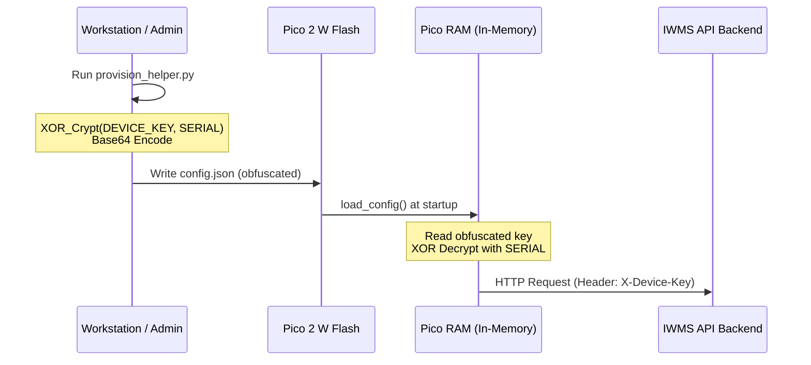

# Pico 2 W Hardware Provisioning & Security Flow

To protect against physical theft of API keys on the hardware terminal, the IWMS Pico 2 W firmware uses a dynamic configuration loader with XOR-base64 obfuscation. No credentials or keys are hardcoded in the source code repository.

---

## 1. Setup Flow

### Step 1: Provision the Device in IWMS Web UI
1. Log in to the IWMS Dashboard as an Admin.
2. Navigate to **Settings** → **Biometric Hardware**.
3. Under the devices list, add a device or click **Provision Key** on your terminal node.
4. A unique, single-use `DEVICE_KEY` (e.g. `iwms_live_7fb8d3a129ef...`) will be generated.
5. Copy the key (it is only shown once).

### Step 2: Generate config.json using the Provisioning Helper
1. Run the local provisioning helper script on your setup machine:
   ```bash
   python provision_helper.py
   ```
2. Enter the requested inputs:
   * **WiFi SSID** / **WiFi Password**
   * **Backend API Base URL** (e.g. `https://iwms.company.com` or local dev IP `http://192.168.2.50:3001`)
   * **Device Serial Number** (must match the serial registered in IWMS, e.g. `pico-gate-01`)
   * **Raw Device Key** (the key copied from the Web UI)
3. The helper script automatically applies a lightweight XOR encryption key (using the serial number) to the device key, base64 encodes it, and saves it to a local `config.json` file.

### Step 3: Flash the Pico 2 W
1. Connect the Pico 2 W to your setup machine via USB.
2. Mount the Pico's filesystem (shows as a USB flash drive).
3. Copy **`main.py`** and the generated **`config.json`** to the root folder of the Pico.
4. Unplug and deploy.

---

## 2. Security Analysis & Dynamic Loading



* **Version Control Protection**: `config.json` holds the credentials and is excluded from git/commits.
* **Anti-sniffing/Anti-tamper**: If the device is stolen or physically mounted via USB, the configuration file only exposes the obfuscated ciphertext (`DEVICE_KEY_OBFUSCATED`), protecting the plain-text key from trivial extraction.
* **API Validation**: The backend hashes incoming `X-Device-Key` headers and compares them to `apiKeyHash` in the database, preventing plaintext key leaks on the network.
